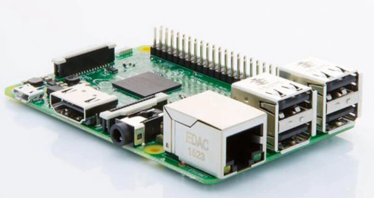

## Leer señales analógicas con MCP3008 usando una Raspberry Pi 3 en Java
---

### Material necesario.
- Raspberri Pi3.
 
- MCP3008 ADC

---
### Pasos.

1. ***MCP3008reader.java***

Archivo del código para la habilitación, configuración y acceso al puerto SPI, desde el puerto GPIO de la Raspberry PI3.

Se utiliza el componente MCP3008 para leer las señales analógicas
Importaciones: Importa las clases necesarias del framework Pi4J para interactuar con el MCP3008.

***MCP3008Reader Clase:*** Esta clase contiene la lógica principal del programa.

***Creación del Dispositivo SPI:*** Crea un SpiDevice llamado spi y lo asigna al canal 0 (CS0). El spi es el punto de entrada para la comunicación con el MCP3008.

***Bucle Principal:*** El programa entra en un bucle infinito (while(true)).

***Lectura del Canal:*** Dentro del bucle, llama a la función readADC() para leer los datos del MCP3008 en el canal especificado (el canal 0).

***Impresión de Resultados:*** Imprime el valor leído en cada lectura.
Espera: Thread.sleep(1000) pausa la ejecución durante 1 segundo entre las lecturas.

***Función readADC():*** Esta función es la clave del programa.
Construcción del Comando: Construye un comando que le indica al MCP3008 que lea el canal especificado. La parte crucial es la combinación de bits: 0b11000000 (el bit de inicio) y (channel << 3) (el bit que define el canal específico).

***Creación del Paquete:*** Crea un byte[] con los datos necesarios para enviar al MCP3008. El packet[0] es el inicio, y packet[1] contiene la dirección del comando (el valor de la variable channel). packet[2] es un byte de relleno.

***Envío de Datos:*** Envía los datos en el paquete al dispositivo SPI usando spi.write(packet).

***Interpretación de la Respuesta:*** El código interpreta los 10 bits de datos recibidos del MCP3008 como una secuencia binaria de 10 bits, que representan un valor. El código extrae el valor de este conjunto de datos en el bit value y lo devuelve.

